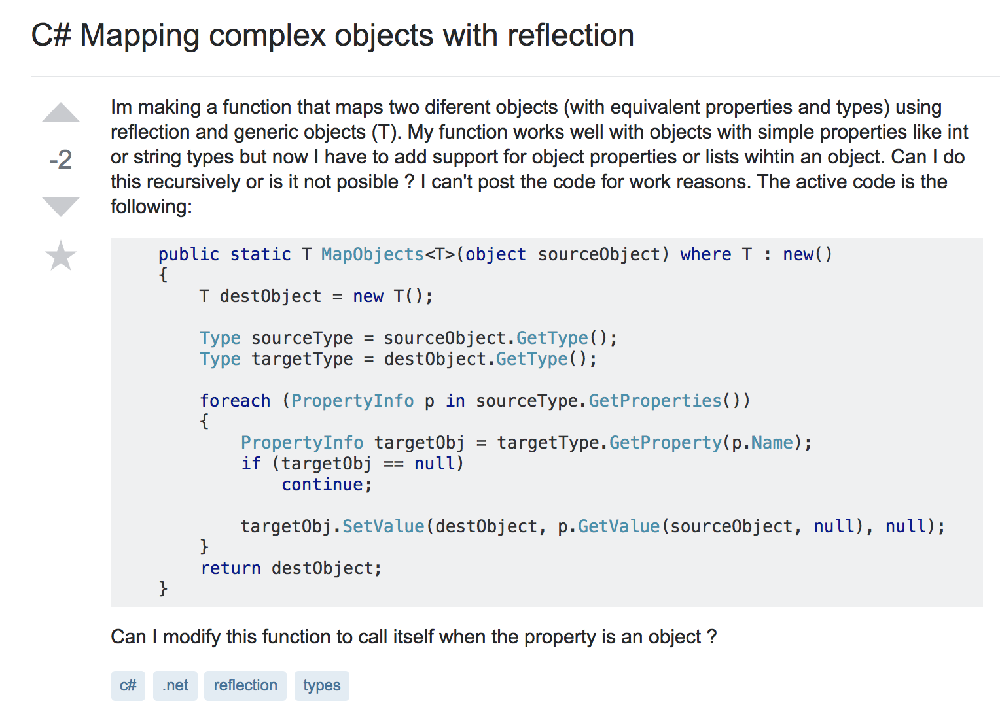
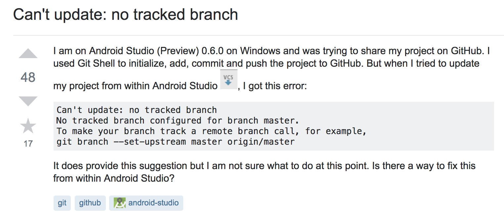

## Smarter Questions --> Smarter Answers

At some point in anyone's professional career they will encounter something that they are unable to solve. While some take the appropriate steps toward seeking help, others chose the "loser" way. The goal of this essay is to educate you on how to ask questions in a way that will yield useful answers.

# The Wrong Way

good: https://stackoverflow.com/questions/24215032/cant-update-no-tracked-branch
bad: https://stackoverflow.com/questions/52230987/c-sharp-mapping-complex-objects-with-reflection