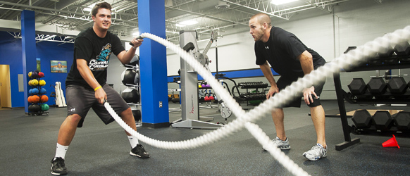

## Java? Javascript? Who cares?

At some point in high school, I learned the basics of both of these very popular languages. I went more in depth with Java thanks to AP Computer Science, but I completed a course on Javascript from Codecademy. At this point both languages looked and preformed very similarly to me, with only some syntax differences here and there. I did not really understand why we needed both. Now that I have gone in depth with Java in college and I am well on my way into Javascript, I see the differences and uses. I think I already like Javascript more. I like the only thing I need to put in front of a variable is either 'const' or 'let'. No need to give the variable a data type or even keep it the same down the road. Javascript feels more dynamic and useful right off the bat and I cannot wait to learn more. 

## Athletic Programming...

Basically, athletic programming is an idea that allows you to train your programming skills like an athlete trains their athletic ones. For example, instead of one long session a week, exercises can be broken down into what are called WODs. WOD stands for Workout Of the Day. With just a short period of intense work each day, you can maximize your learning in a set amount of time.

### ...From an Athlete

I will be honest here. When I heard about athletic programming, I was skeptical. As an athlete, I know the kind of dedication that athletics takes and I was worried about a class that wanted to take as much of my time as football. In reality, it works better for me in multiple ways. The assignments are constant but are not super long which allows me to use the little free time I have each day to do my work. More importantly though, I am used to learning things in the athletic way. After all, I practice five days a week and play a game on the sixth and class just is not that much different. Roughly five days of the week are spent learning and when I come to class on Thursday, it is game time. By this point in both my athletic and software engineering career, stress is a thing of the past. I have been through the ringer in front of thousands of people and have only bounced back stronger. Now I thrive under the pressure and continue to seek it out. 

