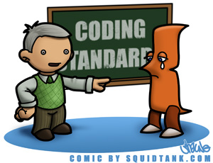

## Trying to Make the Perfect Cookies

Making a website is a lot like baking cookies. You have to have all the base content mixed together and settled before you start to shape the website into its final form. Once you have rolled out all the details, it is time to split all the content into pages. Not just any pages but beautiful pages that take up as much of the content as possible. One way to do this is to use a knife and carefully cut each page out with as much precision as possible. The easier way to ensure the pages look like what you want is to simply use a cookie cutter. 

### The Easier Way

In web development, Semantic UI is the Costco sized pack of cookie cutters. Every type of cookie cutter is there and can be manipulated to look as desired. The smaller tweaks to the Semantic UI components are like the frosting and sprinkles. They are necessary, because the content is all there, but they add flavor and aesthetic appeal.

### The Virtues of Coding Standards

