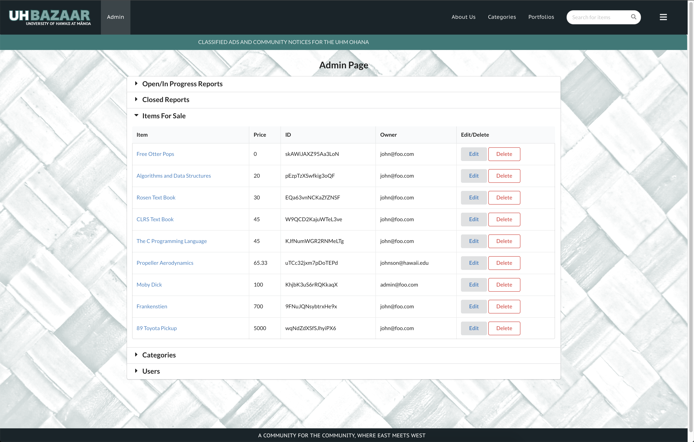

 # UHBazaar
 
 UH Bazaar is a Meteor application that aims to provide a localized marketplace for the University of Hawaii at Manoa community, which accommodates buying, selling and trading goods. UH Bazaar aims to provide a comfortable experience for students by keeping the exchanges on campus and between students. With the tides of incoming and outgoing students, whether graduating or just returning home for the summer, there is a wealth of commodity in need of a custom tailored facilitation to manage exchange. To help facilitate secure exchange, UH Bazaar intends to implement the UH CAS login system to enforce student-student interaction, as well as a goods map for convenient navigation on campus.
 
 
 
 ## Contributions
 
 My main contribution to this app was dealing with the backend and admin functionality. I set up the database and what was included in each of the collections that made up the app. We had a total of four collections that included: users, categories, items for sale, and reports. I frequently updated forms to match the schema behind each collection. Most importantly, I created an interface that allows the admin of the site to view, edit, and delete almost all aspects of the site. 
 
 
 
 ## Takeaways
 
 I learned a lot from this project. Surprisingly, the most important things I learn are not directly related to the coding but instead to the process of creating an app in a team environment. I also learned a lot about working with databases and creating an enticing user interface, but the specifics will always be changing. However, the process and the dynamics of working with others will always be applicable.